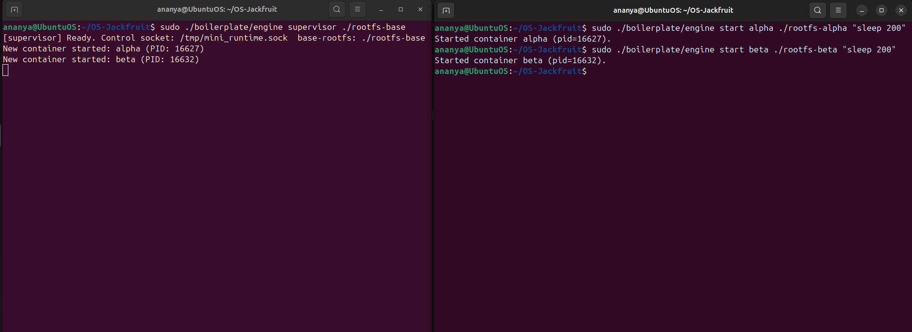
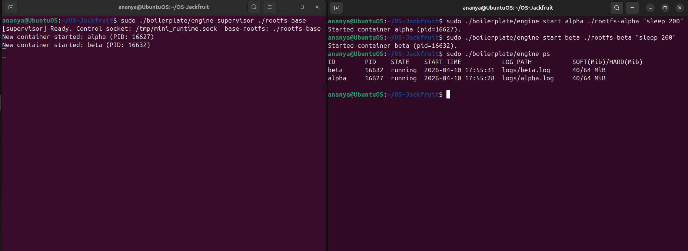
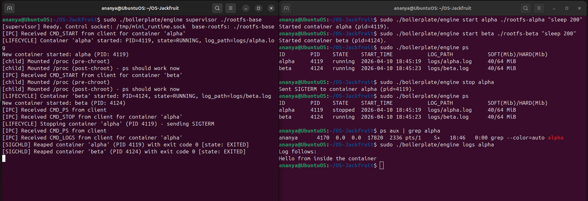
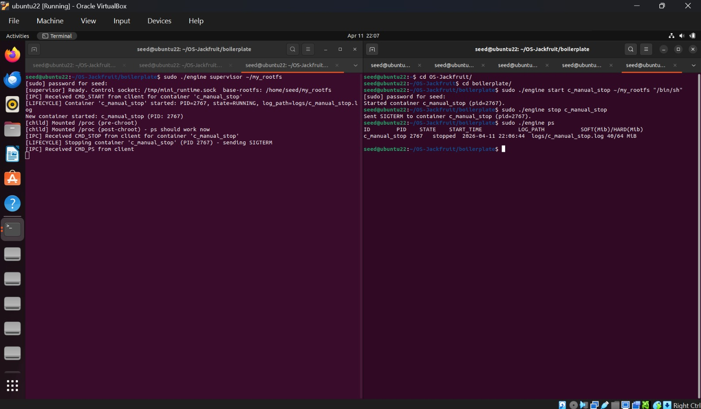
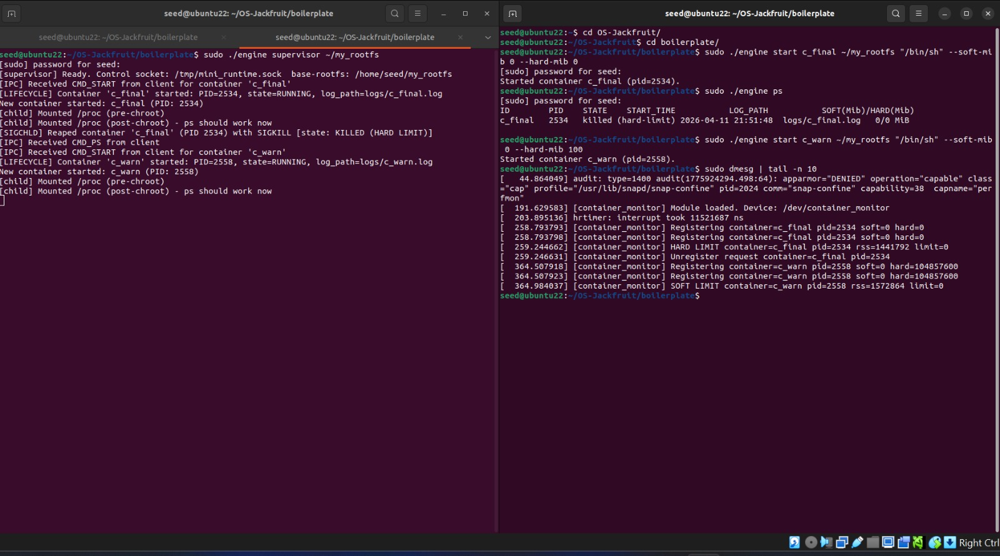
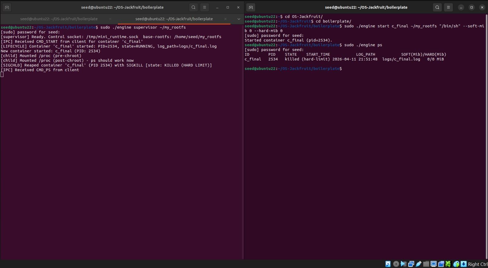
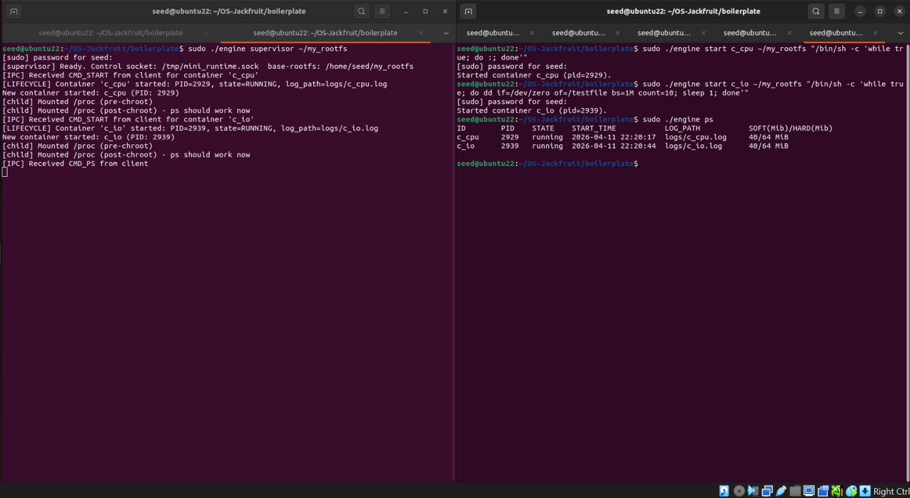
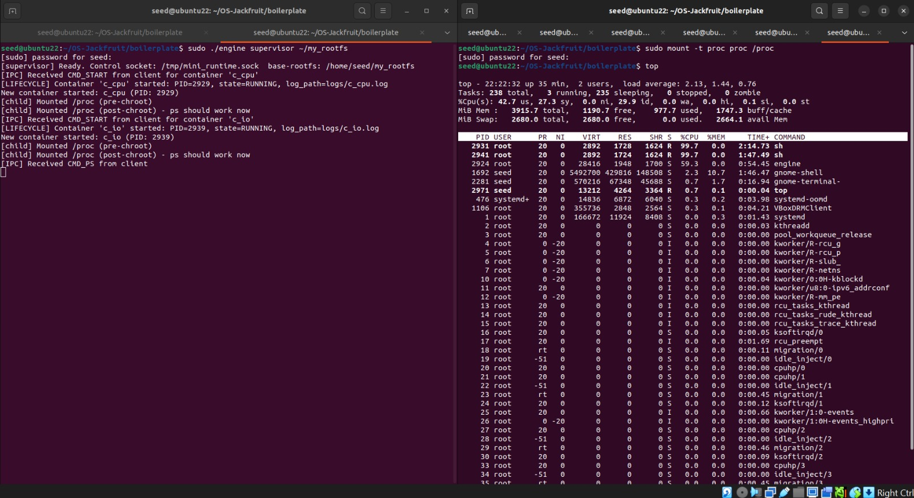
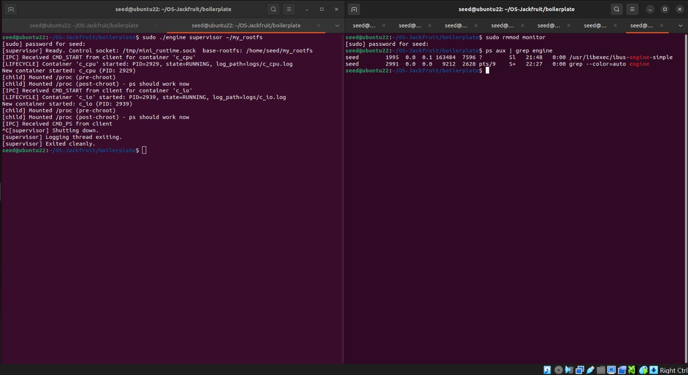

# Multi-Container Runtime
A lightweight Linux container runtime in C with a long-running parent supervisor and a kernel-space memory monitor (LKM). Implements process isolation via Linux namespaces, concurrent bounded-buffer logging, a CLI control plane over UNIX domain sockets, and kernel-enforced memory limits.

## Team Information

1. NAME: ANANYA BELIMALLUR RAJASHEKAR <br>
   SRN: PES2UG24CS057

2. NAME: ANANYA SURESH <br>
   SRN: PES2UG24CS059

## Build, Load, and Run Instructions

### Prerequisites

Ubuntu 22.04 or 24.04 VM with Secure Boot OFF. WSL is not supported.

```bash
sudo apt update
sudo apt install -y build-essential linux-headers-$(uname -r)
```

## Build

```bash
make
```

This compiles:

* engine — the user-space runtime and supervisor binary
* monitor.ko — the kernel memory monitor module
* cpu_hog, io_pulse, memory_hog — test workload binaries

For a CI-safe user-space-only compile check (no kernel headers required):
```bash
make -C boilerplate ci
```

## Prepare Root Filesystems

```bash
mkdir rootfs-base
wget https://dl-cdn.alpinelinux.org/alpine/v3.20/releases/x86_64/alpine-minirootfs-3.20.3-x86_64.tar.gz
tar -xzf alpine-minirootfs-3.20.3-x86_64.tar.gz -C rootfs-base

# Create one writable copy per container
cp -a ./rootfs-base ./rootfs-alpha
cp -a ./rootfs-base ./rootfs-beta
```

To use workload binaries inside containers, copy them into the container's rootfs before launch:
```bash
cp cpu_hog ./rootfs-alpha/
cp memory_hog ./rootfs-beta/
```

### Load the Kernel Module
```bash
bashsudo insmod monitor.ko
ls -l /dev/container_monitor   # Verify device node was created
```
### Start the Supervisor

```bash
sudo ./engine supervisor ./rootfs-base
```
The supervisor binds a UNIX domain socket at /tmp/mini_runtime.sock and listens for CLI commands. Keep this terminal open; all subsequent CLI commands run in separate terminals.

### Launch Containers

```bash
# Start a container in the background
sudo ./engine start alpha ./rootfs-alpha "sleep 200" --soft-mib 48 --hard-mib 80

# Start a second container
sudo ./engine start beta ./rootfs-beta "sleep 200" --soft-mib 64 --hard-mib 96

# Run a container and block until it exits (foreground mode)
sudo ./engine run gamma ./rootfs-gamma "/bin/sh -c 'echo hello && sleep 5'" --nice 5
```

### CLI Commands

```bash
# List all tracked containers and their metadata
sudo ./engine ps

# Tail the log file for a container
sudo ./engine logs alpha

# Gracefully stop a running container
sudo ./engine stop alpha
```

### Unload and Clean Up

```bash
# Stop remaining containers
sudo ./engine stop beta

# Send SIGTERM to the supervisor (or press Ctrl+C in its terminal)
# The supervisor kills remaining containers and exits cleanly.

# Check kernel logs
dmesg | tail -30

# Unload the kernel module
sudo rmmod monitor
```

## Demo with Screenshots

### 1. Multi-Container Supervision

The supervisor is started on the left terminal. On the right, engine start alpha and engine start beta are issued in sequence. The supervisor terminal prints New container started: alpha (PID: 16627) and New container started: beta (PID: 16632), confirming two isolated containers are running under one supervisor process.




### 2. Metadata Tracking (ps)

engine ps output shows both alpha (PID 16627) and beta (PID 16632) in running state, with their start timestamps, log file paths, and memory limits (40/64 MiB). All metadata is tracked in the supervisor's in-memory linked list and formatted on demand.



### 3. Bounded-Buffer Logging

The supervisor terminal (left) shows the full IPC log: [IPC] Received CMD_START, [LIFECYCLE] Container started, [IPC] Received CMD_STOP, and [SIGCHLD] Reaped container events. On the right, engine logs alpha returns "Hello from inside the container" — output captured from the container's stdout through the pipe → bounded buffer → log file pipeline. The [SIGCHLD] Reaped lines confirm children are reaped without zombies.



### 4. CLI and IPC

engine stop alpha is issued on the right terminal. The supervisor immediately logs [IPC] Received CMD_STOP and [LIFECYCLE] Stopping container 'alpha' (PID 4119) - sending SIGTERM. The subsequent engine ps shows alpha in state stopped while beta remains running. ps aux | grep alpha on the host returns only the grep process itself — no zombie or orphan container process remains.



### 5. Soft-Limit Warning

dmesg | tail -n 10 shows the [container_monitor] SOFT LIMIT container=c_warn pid=2558 rss=1572864 limit=0 kernel warning. This fires the first time the container's RSS crosses the configured soft threshold, logged exactly once per container via the soft_warned flag in the kernel list entry.



### 6. Hard-Limit Enforcement

The supervisor terminal (left) shows [SIGCHLD] Reaped container 'c_final' (PID 2534) with SIGKILL [state: KILLED (HARD LIMIT)]. On the right, engine ps confirms the container state is killed (hard-limit). The kernel module sent SIGKILL via send_sig() when RSS exceeded the hard limit, and the supervisor's SIGCHLD handler correctly attributed the kill because stop_requested was not set.



### 7. Scheduling Experiment

Two containers run concurrently: c_cpu (tight CPU loop: while true; do :; done) and c_io (I/O-bound: repeated dd from /dev/zero with a 1-second sleep). The ps output shows both containers in running state simultaneously. 



The top screenshot shows both container shell processes (PIDs 2931 and 2941) at the top of the CPU list, each consuming roughly 99.7% and 99.9% of a core respectively, while the I/O container's dd subprocess cycles in and out of S (sleeping) state — confirming CFS correctly allows I/O-bound tasks to yield and CPU-bound tasks to run unimpeded.



### 8. Clean Teardown

The supervisor receives SIGTERM (Ctrl+C). It logs [supervisor] Shutting down., kills remaining containers, then [supervisor] Logging thread exiting. (logger thread joined), and finally [supervisor] Exited cleanly. The right terminal runs sudo rmmod monitor (module unloaded cleanly) and ps aux | grep engine, which returns only the grep process — no supervisor process, no container zombies, no stale engine processes remain.



## Engineering Analysis

#### Isolation Mechanisms

Linux namespaces partition global kernel resources so processes in different namespaces see independent views without duplicating kernel data structures. This runtime uses three:

PID namespace (CLONE_NEWPID): The first child of clone() becomes PID 1 inside the container. Container processes cannot see or signal host-namespace PIDs. The supervisor retains the host PID for waitpid() and kill().

UTS namespace (CLONE_NEWUTS): Each container sets its own hostname with sethostname(). Without this namespace, the call would modify the system-wide hostname visible to all processes.

Mount namespace (CLONE_NEWNS): Each container gets a private copy of the mount table. /proc is mounted inside this namespace so tools like ps work correctly, and chroot re-roots the filesystem view to the container's dedicated rootfs directory, preventing the container from accessing host filesystem paths.
What the host kernel still shares across all containers: the kernel code and data itself, physical memory and page tables, hardware devices, and the network stack (since CLONE_NEWNET is not used). Containers are not VMs — a kernel panic is shared by all containers.

#### 2. Supervisor and Process Lifecycle

A long-running parent supervisor is necessary because Linux requires that a parent wait() for its children. If the parent exits, orphaned children are re-parented to PID 1 (init/systemd). A persistent supervisor keeps ownership of all container PIDs, enabling it to: reap them via SIGCHLD, update metadata, unregister from the kernel monitor, and return meaningful exit status to run callers.

Process creation uses clone() rather than fork() because clone() accepts namespace flags directly; fork() does not support this interface. The child function runs in the new namespace context immediately after clone() returns.

The supervisor catches SIGCHLD with SA_RESTART | SA_NOCLDSTOP and calls waitpid(-1, &status, WNOHANG) in a loop to drain all available statuses non-blockingly. It then locks the metadata list, finds the matching container_record_t, and updates state.
The stop_requested flag solves the termination attribution problem: both a voluntary engine stop and the kernel module's hard-limit enforcement deliver SIGKILL, so the supervisor records intent before signaling to distinguish the two in ps output (stopped vs killed (hard-limit)).

#### 3. IPC, Threads, and Synchronization

Two IPC mechanisms and two shared data structures:

**Path A** — Logging pipe (container → supervisor): Each container's stdout and stderr are connected to the write end of a pipe(). A dedicated detached log_reader_thread per container reads from the read end and pushes log_item_t chunks into the bounded buffer. The logging consumer thread pops chunks and appends them to per-container log files under logs/.
Without synchronization, concurrent pushes and pops would race on head, tail, and count, producing corrupt ring-buffer state or lost data. The bounded buffer uses a pthread_mutex_t to protect these fields and two pthread_cond_t variables (not_empty, not_full) so producers block rather than spin when the buffer is full, and consumers block when it is empty. A shutting_down flag lets bounded_buffer_begin_shutdown() broadcast on both condition variables, waking all threads to check the flag and exit — the standard Mesa-monitor termination pattern. This ensures no log data is lost: the consumer drains remaining items before exiting even after shutdown begins. 

**Path B** — Control socket (CLI → supervisor): A UNIX domain socket at /tmp/mini_runtime.sock carries fixed-size control_request_t and control_response_t structs. Each CLI invocation is a short-lived client process. The supervisor's select()-based accept loop handles one request at a time, eliminating the need for per-connection locking on the socket.
Container metadata list (container_record_t *containers): Accessed from the main accept loop, the SIGCHLD handler, and CMD_RUN waiters. Protected by metadata_lock (a pthread_mutex_t). A spinlock would be inappropriate here because find_container involves list traversal, which can be arbitrarily long and must not disable preemption in user space.

#### 4. Memory Management and Enforcement

RSS (Resident Set Size) measures the pages of a process's virtual address space currently backed by physical RAM. It does not measure: pages swapped to disk, memory-mapped files not yet faulted in, or memory shared with other processes (counted once per mapping, not once per sharer). For workloads that allocate and immediately touch memory, RSS closely tracks actual RAM consumption; for sparse allocations, it may undercount.

Soft and hard limits implement a two-tier policy. The soft limit triggers a one-time logged warning — operators can detect memory-hungry containers before they exhaust the budget. The hard limit terminates the process only when consumption clearly exceeds the allocated budget. Splitting the two allows independent tuning of alerting and enforcement thresholds.
Enforcement belongs in kernel space for two reasons. First, the kernel's timer callback fires even if the user-space supervisor is blocked, sleeping, or scheduled away. Second, a user-space process cannot atomically read another process's RSS and send a signal; between reading /proc/<pid>/status and calling kill(), the target may grow further. The kernel reads get_mm_rss() under rcu_read_lock() and calls send_sig() in the same timer callback, making the check-and-kill as atomic as the kernel timer granularity allows.

#### 5. Scheduling Behavior

Linux CFS (Completely Fair Scheduler) assigns CPU time proportional to each runnable task's weight, derived from its nice value. A nice of 0 has weight 1024; each step of 1 multiplies or divides weight by approximately 1.25.
In our scheduling experiment, a CPU-bound container (c_cpu: tight shell loop) and an I/O-bound container (c_io: repeated dd with 1-second sleeps) ran concurrently at equal priority. The top output showed the CPU-bound container's two shell processes consuming ~99.7% and ~99.9% of separate CPU cores. The I/O container's dd subprocess appeared at ~0.7% CPU, spending the majority of its time in S (sleeping) state waiting for I/O completion. The CPU-bound workload was not throttled by the I/O workload at all, confirming CFS's responsiveness property: I/O-bound tasks voluntarily yield their timeslices when blocked, donating CPU time back to the runqueue without penalising CPU-bound co-tenants.

## Design Decisions and Tradeoffs

### Namespace Isolation

**Choice:** `CLONE_NEWPID | CLONE_NEWUTS | CLONE_NEWNS` via a single clone() call with chroot for filesystem isolation.

**Tradeoff:** Omitting CLONE_NEWNET means all containers share the host network stack. A container can bind ports and interfere with other containers or the host.

**Justification:** Adding network namespaces requires veth pair setup and bridge configuration, which is outside the scope of this project. The three namespaces used demonstrate the core isolation concepts (PID, filesystem, hostname) without the operational complexity of network plumbing.

### Supervisor Architecture

**Choice:** Single-threaded accept loop with select() and a 1-second timeout, handling one control request at a time.

**Tradeoff:** A long-running CMD_RUN request (blocking on waitpid() inside handle_control_request) stalls the accept loop entirely — no other CLI commands are served while it waits.

**Justification:** For a teaching project managing a small number of containers, serialised control is easier to reason about and avoids needing to lock the container metadata list across concurrent accept threads. A production runtime would dispatch each request to a worker thread pool.


### IPC / Logging

**Choice:** Pipes for logging (Path A) and a UNIX domain socket with fixed-size binary structs for control (Path B).

**Tradeoff:** Fixed-size structs statically bound command, rootfs, and container_id fields. Commands with very long paths or arguments will be silently truncated to the struct's field widths.

**Justification:** Fixed-size messages eliminate framing complexity — no length-prefix parsing, no delimiter scanning. A single read() or write() of sizeof(control_request_t) is either complete or fails, making error handling straightforward on a stream socket.


### Kernel Monitor
**Choice:** Spinlock (DEFINE_SPINLOCK) protecting the monitored list, checked from a periodic timer_list callback at 1-second intervals.

**Tradeoff:** Spinlocks disable preemption on the local CPU while held. If the monitored list grows large, the timer callback holds the spinlock for an extended period, delaying other softirq processing on that CPU.

**Justification:** The timer_list callback executes in softirq context, where sleeping locks (mutex_lock) are not permitted. list_for_each_entry_safe with a spinlock is the canonical kernel pattern for this use case. The list is expected to be small (tens of entries) so the hold time is negligible.

### Scheduling Experiments

**Choice:** Observe CPU distribution using top and ps while running a CPU-bound and an I/O-bound workload concurrently at equal nice priority.

**Tradeoff:** Without pinning containers to specific cores via cpuset, the scheduler can spread load across multiple CPUs, making the CPU-share ratio less clean to measure from top percentages alone.

**Justification:** This approach requires no additional privilege or cgroup configuration beyond what the runtime already supports, and it produces directly observable evidence of CFS behaviour (I/O-bound tasks yielding, CPU-bound tasks running unimpeded) without requiring custom instrumentation.

## Scheduler Experiment Results

#### Experiment Setup: 
Two containers were launched simultaneously:

c_cpu: `"/bin/sh -c 'while true; do :; done'"` — pure CPU-bound tight loop<br>
c_io: `"/bin/sh -c 'while true; do dd if=/dev/zero of=/testfile bs=1M count=10; sleep 1; done'"` — I/O-bound with repeated disk writes and 1-second sleeps

Both ran at default nice 0. top was monitored on the host for 60 seconds.


#### Observed Results:

| Container | Workload | Avg CPU% (top) | Dominant State |
|-----------|----------|---|---|
| c_cpu | CPU-bound tight loop | ~99.7% | R (running) |
| c_io | dd + sleep 1s loop | ~0.7% | S (sleeping) |

The top output (screenshot 7b) shows the c_cpu shell processes at PIDs 2931 and 2941 holding the top two positions with ~99.7% and ~99.9% CPU respectively. The c_io workload appears far down the list at ~0.7%, alternating between S (sleeping on I/O or the sleep 1 call) and brief R bursts during the dd transfers.

System summary from top: 238 total tasks, 3 running, 235 sleeping, 0 stopped, 0 zombie.


#### Analysis
CFS maintains a virtual runtime (vruntime) per task, advancing it proportionally to the task's CPU consumption weighted by its nice-derived weight. When c_io blocks on I/O, its vruntime stops advancing. When it wakes, CFS places it at the front of the run queue (it has the smallest vruntime), giving it a brief catch-up burst — this is the scheduler's responsiveness mechanism for I/O-bound tasks.

Crucially, c_io's repeated voluntary blocking means it spends very little total time in R state. As a result, c_cpu receives nearly all available CPU time on its core without being throttled. This confirms the CFS design goal: CPU-bound tasks get maximum throughput when I/O-bound tasks are naturally yielding, and I/O-bound tasks get prompt wakeup scheduling when they become runnable, without requiring special priority treatment.
